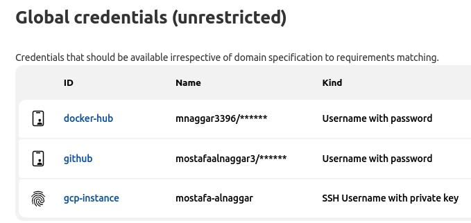

## Description:

Deploy a pipeline that builds a new docker image from a simple node application, push it to the docker hub and deploy it on a Jenkins slave.

---

## Repo components:

- node-app: this directory have node app files.
- docker file: to build a new docker image from the node app.
- node-app-k8s-: this directory have k8s yml files to deploy the node app.
- jenkinsfile: this file has the pipeline code.

---

## Tools:

<p align="center">


</p>

---

# Solution steps:

### 1- Add Github, docker hub, and GCP instance credentials on Jenkins:

- **Github credential:**
    
    1- From github create a new token
    
    2- On jenkins create a new credential with a kind username and password:
    
    username: your github username
    
    password: the token which you created from github
    
    id: github
    
- **Docker hub:**
    
    On jenkins create a new credential with a kind username and password:
    
    username: your docker hub username
    
    password: your docker hub password
    
    id: docker-hub
    
- **GCP instance credential**:
    
    1- Create a key in the instance and make authorized_keys file
    
    ```bash
    # ssh on the instance
    $ gcloud compute ssh --zone "europe-west1-b" "jenkins-management-vm"  --tunnel-through-iap --project "mostafa-alnaggar-project"
    
    # create a key
    $ ssh-keygen  # this command will create a private and public key [ id_rsa , id_rsa.pub ]
    
    # create authorized_keys file and put public key in the file 
    $ cp id_rsa.pub authorized_keys
    $ chmod 600 authorized_keys
    ```
    
    2- On Jenkins create a new credential with kind ssh with username and private key:
    
    id: gcp-instance
    
    username: the user on  the instance which you need to ssh on it
    
    private key: the private key that we generated on the instance
    



---

### 2- Add management instance as a Jenkins slave:

Node configurations:


---

### 3- Create a new pipeline and deploy it on gcp-instance slave:

Pipeline configurations:


Build pipeline:


K8s resources:


Finally, access the jekins-app-svc **http://35.195.105.101:3000/** Welcome to the app 🥳:

<p align='center' >

</p >